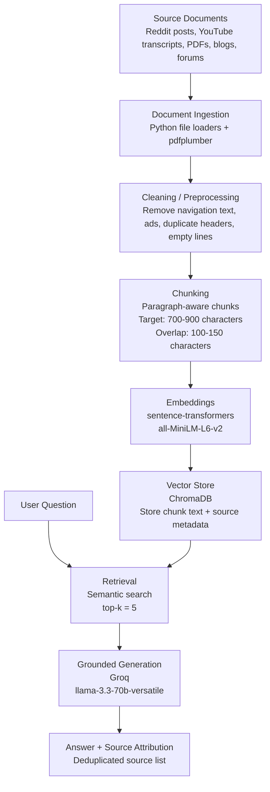

# Project 1 Planning: The Unofficial Guide

> Write this document before you write any pipeline code.
> Your spec and architecture diagram are what you'll use to direct AI tools (Claude, Copilot, etc.) to generate your implementation — the more specific they are, the more useful the generated code will be.
> Update the Retrieval Approach and Chunking Strategy sections if you change your approach during implementation.
> Update this file before starting any stretch features.

---

## Domain

<!-- What domain did you choose? Why is this knowledge valuable and hard to find through official channels? -->

A student-generated reviews, study strategies, and course-completion assistant for Western Governors University courses because it helps students discover practical insights, recommended resources, difficulty assessments and success strategies that are often scattered across various discussions, blogs, forums, and alumni experiences rather than official university materials.

## Documents

<!-- List your specific sources: URLs, subreddit names, forum threads, or file descriptions.
     Aim for at least 10 sources that together cover different subtopics or perspectives within your domain. -->

| # | Source | Description | URL or location |
|---|--------|-------------|-----------------|
| 1 | Reddit | Review of classen taken | https://www.reddit.com/r/WGU_CompSci/comments/1k7xbko/review_of_all_wgu_classes_i_took_tips_as_an/ |
| 2 | YouTube | Survival Tips to complete your WGU degree | https://www.youtube.com/watch?v=yriZNpncMwI |
| 3 | Stunlock | My thoughts on WGU and Online Schools | https://stunlock.gg/posts/undergrad/ |
| 4 | InfoSecInstitute | Starting WGU MBA IT Management|  https://community.infosecinstitute.com/discussion/134945/starting-wgu-mba-it-management-on-mar-1-2019/p2 |
| 5 | Reddit | Structure of a Typical Course | https://www.reddit.com/r/WGU/comments/y8q6ui/structure_of_a_typical_course/ |
| 6 | Degree Forum | Tips for success at WGU | https://www.degreeforum.net/mybb/Thread-Tips-for-success-at-WGU-to-finish-in-a-single-term |
| 7 | Reddit | What is your best study method | https://www.reddit.com/r/WGU/comments/14pxj4o/what_is_your_best_study_method/ |
| 8 | YoutTube | How to finish as fast as possible | https://www.youtube.com/watch?v=nUhsV0IpXWg |
| 9 | YoutTube | Tips to study 2x - 3x faster | https://www.youtube.com/watch?v=7kTkSGWExLw |
| 10 | YouTube | How to Succeed at WGU | https://www.youtube.com/watch?v=QPfMchoITKU |
| 11 | Reddit | A Comprehensive Guide to WGU | https://www.reddit.com/r/WGU/comments/1goyuwa/a_comprehensive_guide_to_wgu_my_full_honest/ 
| 12 | Reddit | Need all the advice and resources | https://www.reddit.com/r/WGU/comments/1pb39gx/need_all_the_advice_and_resources/ |

---

## Chunking Strategy

<!-- How will you split documents into chunks?
     State your chunk size (in tokens or characters), overlap size, and explain why those
     numbers fit the structure of your documents.
     A review-heavy corpus warrants different chunking than a long FAQ. -->

**Chunk size:**
Paragraph-aware chunking
Target size: 700 - 900 characters
**Overlap:**
100 - 150 characters
**Reasoning:**
This chunking strategy was chosen to help with semantic completeness and to contain a complete idea. The Algorithm should 1. Split by paragraph boundaries. 2 Combine paragraphs until approximately 800 characters. 3. Add 100 -150 overlap. 4. Preserve source metadata.
---

## Retrieval Approach

<!-- Which embedding model are you using (e.g., all-MiniLM-L6-v2 via sentence-transformers)?
     How many chunks will you retrieve per query (top-k)?
     If you were deploying this for real users and cost wasn't a constraint, what tradeoffs
     would you weigh in choosing a different embedding model — context length, multilingual
     support, accuracy on domain-specific text, latency? -->

**Embedding model:**
sentence-transformers (all-MiniLM-L6-v2) which runs locally and does not require an API key and has no rate limits.
**Top-k:**
I will start with top-k=5 because it gives the LLM enough retrieved context to answer questions from multiple student sources while limiting noise from loosely related chunks. 
**Production tradeoff reflection:**
If deployed in production, I would evaluate larger embedding
models that provide higher retrieval accuracy on educational
content.

I would compare retrieval quality against latency and cost.
I would also consider multilingual support if the system
served international students and benchmark several models
against my evaluation dataset before making a final decision.
---

## Evaluation Plan

<!-- List your 5 test questions with their expected correct answers.
     Questions should be specific enough that you can judge whether the system's response
     is right or wrong. "What are good dining halls?" is too vague.
     "What do students say about wait times at [dining hall name] during lunch?" is testable. -->

| # | Question | Expected answer |
|---|----------|-----------------|
| 1 | What study techniques do students most frequently recommend for WGU courses? | Students recommend using course resources, taking practice assessments, reviewing Quizlets, and focusing on competency mastery rather than memorization |
| 2 | What are specific study tips for OA and PA assessments? | OAs are commonly approached through practice tests, flashcards, and course materials. PAs are typically completed by following the rubric closely and addressing each requirement directly. |
| 3 | What are three strategies to complete your WGU courses faster? | Students recommend accelerating by: 1. Studying before the term begins, Completing assessments as soon as ready. 3. Leveraging outside resources such as Quizlet and YouTube |
| 4 | How do WGU courses compare to traditional college courses | Students describe WGU as self-paced, compentency-based, and less dependent on scheduled lectures than traditional universities. |
| 5 | What resources do students recommend outside of official WGU materials? | Students recommend using outside resources like Reddit, YouTube, and Quizlet. |

---

## Anticipated Challenges

<!-- What could go wrong? Name at least two specific risks with reasoning.
     Consider: noisy or inconsistent documents, missing source attribution, off-topic
     retrieval, chunks that split key information across boundaries. -->

1. Retrieval Quality: Reddit posts, forum discussions, and student-generated content may contain off-topic or inconsistent information. This could cause semantic search to retrieve less relevant chunks for certain questions.

2. Source Attribution: Since documents will be converted into text and chunked before being stored in ChromaDB, there is a risk that source metadata could be lost or incorrectly associated with chunks. Proper metadata tracking is necessary to ensure accurate citations.

3. Chunk Boundary Issues: Important information may be split across chunk boundaries, reducing retrieval quality if only part of the relevant context is returned.

4. Conflicting Student Advice: Different students may recommend different study approaches or resources. The system must present grounded answers based on retrieved evidence rather than assuming a single correct recommendation.

---

## Architecture

<!-- Draw a diagram of your pipeline showing the five stages:
     Document Ingestion → Chunking → Embedding + Vector Store → Retrieval → Generation
     Label each stage with the tool or library you're using.
     You can use ASCII art, a Mermaid diagram, or embed a sketch as an image.
     You'll use this diagram as context when prompting AI tools to implement each stage. -->

## Architecture

## AI Tool Plan

<!-- For each part of the pipeline below, describe:
     - Which AI tool you plan to use (Claude, Copilot, ChatGPT, etc.)
     - What you'll give it as input (which sections of this planning.md, which requirements)
     - What you expect it to produce
     - How you'll verify the output matches your spec

     "I'll use AI to help me code" is not a plan.
     "I'll give Claude my Chunking Strategy section and ask it to implement chunk_text()
     with my specified chunk size and overlap" is a plan. -->

## AI Tool Plan

I plan to use ChatGPT as a coding and implementation assistant, but I will review, test, and modify the generated code myself.

| Pipeline Stage         | AI Tool Plan                                                                                                                                                                                                                           |
| ---------------------- | -------------------------------------------------------------------------------------------------------------------------------------------------------------------------------------------------------------------------------------- |
| Document ingestion     | I will give ChatGPT my Documents section and ask it to help design a `load_documents()` function that loads PDFs and text files from my local `documents/` folder while preserving each file name as source metadata.                  |
| Cleaning               | I will provide examples of raw extracted text and ask ChatGPT to help create a cleaning function that removes extra whitespace, navigation text, repeated headers, empty lines, and other non-substantive content.                     |
| Chunking               | I will give ChatGPT my Chunking Strategy section and ask it to help implement `chunk_document()` using paragraph-aware chunking with 700–900 character target chunks and 100–150 character overlap.                                    |
| Embedding and ChromaDB | I will give ChatGPT my Retrieval Approach section and ask it to help implement `get_collection()` and `embed_and_store()` using `sentence-transformers/all-MiniLM-L6-v2` and ChromaDB, while storing source metadata with every chunk. |
| Retrieval              | I will ask ChatGPT to help implement a `retrieve()` function that accepts a user query, embeds it, searches ChromaDB, and returns the top 5 chunks with their text, distance scores, and metadata.                                     |
| Generation             | I will ask ChatGPT to help write `generate_response()` using Groq and `llama-3.3-70b-versatile`, with a grounding prompt that instructs the model to answer only from retrieved context and say when there is not enough information.  |
| Interface              | I will provide ChatGPT my Architecture section and ask it to help build a simple Gradio interface with a question input, generated answer output, and visible source attribution.                                                      |
| Review and debugging   | I will use ChatGPT to explain errors, review my code, and suggest improvements, but I will verify that each function matches my planning document and assignment requirements before moving forward.                                   |

**Milestone 3 — Ingestion and chunking:**

**Milestone 4 — Embedding and retrieval:**

**Milestone 5 — Generation and interface:**
